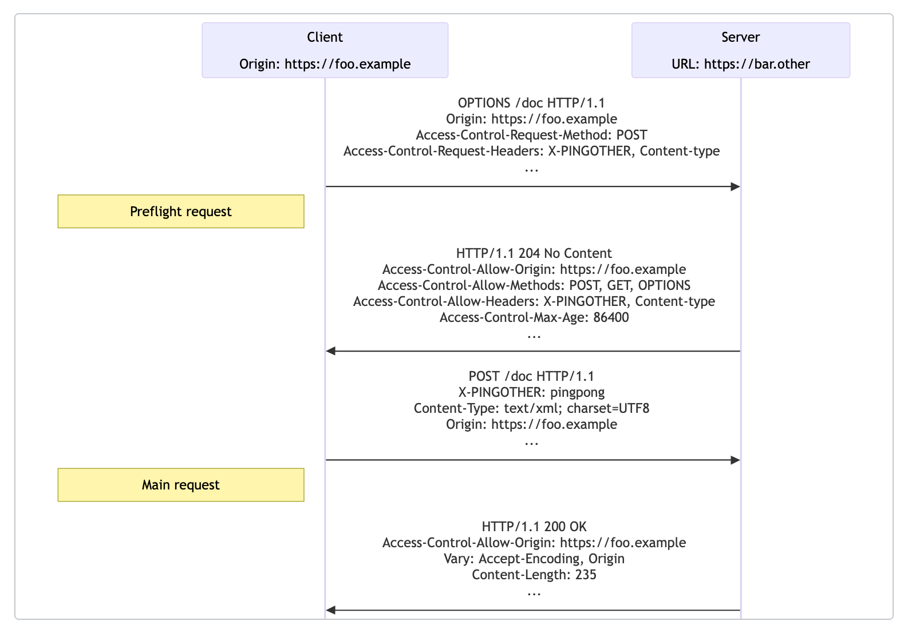

# CORS

### How CORS works

	1. Client makes a request to site http://example.com/index.html using a browser
	2. Server returns the index.html page. This page fetches an image from another server http://mysite.com
	3. The browser detects that a resource from another origin is being requested. A Cross Origin Resource Sharing
	4. Browser sends a preflight OPTIONS request with the Origin header, to ask http://mysite.com if it will accept requests from http://example.com
	5. The http://mysite.com returns a Access-Control-Allow-Origin with the allowed origins and Access-Control-Allow-Methods with the allowed methods
	6. The browser checks the Access-Control-Allow-Origin and Access-Control-Allow-Methods headers. If the http://example.com origin is listed in the header, then the main request(POST, GET, etc) is performed

### Notes
- Tools like curl or postman don't add the Origin header automatically like the browser does

### Resources

- https://developer.mozilla.org/en-US/docs/Web/HTTP/Guides/CORS

